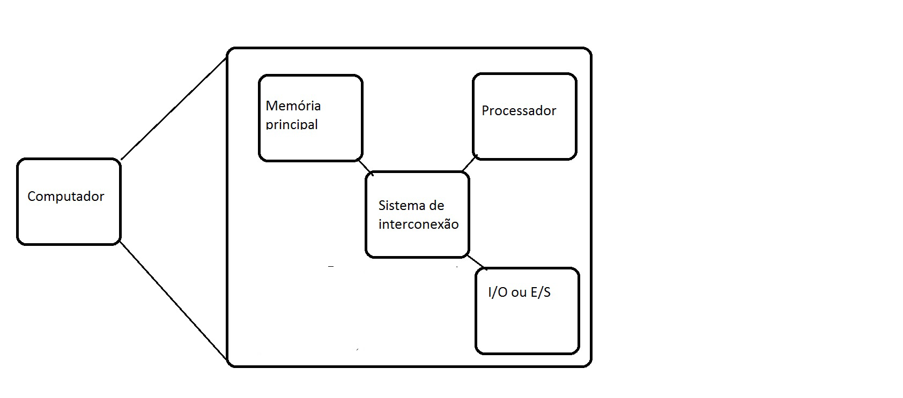
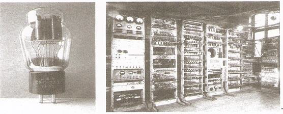
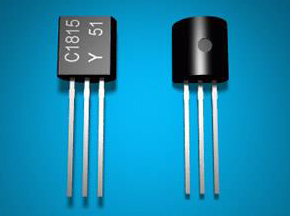
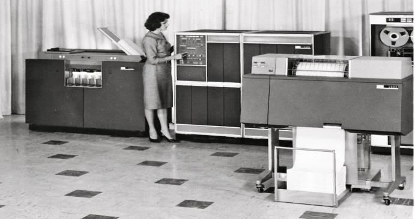
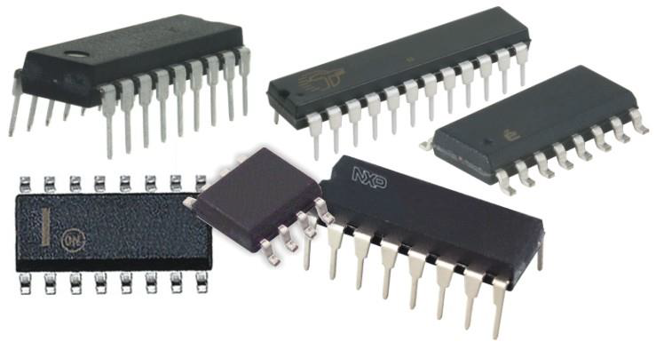

## Arquitetura de Computadores

### Ementa

- Arquitetura básica de um computador, CPU, memória, periféricos.
- Armazenamento e representação de dados: base binária, ponto flutuante, caractere. Conceitos da lógica digital.
- Armazenamento e representação de instruções. Modos de endereçamento.
- Conjunto típico de instruções de uma CPU.
- Montagem de Computador.
- Configuração de microcomputador.
- Tratamento de entradas e saídas de dados em computadores.
- Arquiteturas.

##

### Objetivo

> Capacitar os alunos a reconhecer os componentes básicos de computadores: processador, memória, entradas, saídas e barramentos e a analisar criticamente diferentes arquiteturas de computadores.

##

### Competências

- Identificar os componentes de um computador.
- Compreender o funcionamento e a estrutura dos componentes de um computador.
- Analisar as características de um computador quanto ao desempenho e especificar os parâmetros adequados para diferentes tipos de aplicações.

##

### Habilidades

* Projetar um computador pelos seus componentes básicos.

* Especificar os parâmetros de Hardware para diferentes tipos de aplicações.

* Analisar as características de Hardware de um computador para que tenha desempenho compatível com o uso almejado do computador

##

### Bibliografia

1. TANENBAUM, Andrew S., Organização estruturada de computadores. 6ª. ed. Rio de Janeiro: Pearson Universidade,  2013.

2. STALLINGS, William. Arquitetura e organização de computadores. 10ª. ed. São Paulo: Pearson,  2017.

3. HENNESSY, J.L.; .PATTERSON, D., Arquitetura de Computadores: Uma abordagem quantitativa, 5ª ed., Elsevier, 2014.

4. FÁVERO, E.M.B. Organização e Arquitetura de Computadores, Pato Branco: Universidade Tecn. Fed. do Paraná, 2011, http://redeetec.mec.gov.br/images/stories/pdf/eixo_infor_comun/tec_inf/081112_org_arq_comp.pdf, acessado em 11/02/2020.

## Introdução

- Arquitetura x Organização de Computadores
- Segundo Stallings:
  + Arquitetura mostra a estrutura lógico/funcional dos componentes de um computador - se refere aos atributos do sistema que são visíveis ao programador
  + Organização mostra a estrutura física dos componentes de um computador
- Organização dos Computadores $\rightarrow$ Engenharia de Computação

## O que é um computador?

* É uma máquina que executa um programa armazenado. ???

* O que é um programa?
  - um punhado de instruções para resolver um *problema*

## Componentes de um computador

## Componentes

* **Processador**: CPU - unidade central de processamento (UCP) - componente responsável pela execução das instruções

* **Memória**: componente que armazena dados e instruções

* **Entrada**: componente que captura os dados externos ao computadores

* **Saída**: componente que *mostra* os dados para os meios externos ao computador

* **Entrada/Saída**: componente que captura e mostra dados para os meios externos ao computador ou que faz comunicação com outros meios e computadores

* **Barramento**: componente que faz a comunicação de dados/instruções e endereços entre os outros componentes

## Exercícios

1. Explique com as suas palavras no que consiste um sistema computacional.
2. Qual a diferença entre um computador analógico e um computador digital?
3. Os computadores atuais são analógicos ou digitais?
4. O que John von Neumann significou para a computação?
5. Qual a composição do modelo de von Neumann e qual a relação desse modelo com os computadores atuais?
6. No que consiste um transistor e qual a sua contribuição para a evolução dos computadores?
7. Qual a função dos circuitos integrados?
8. Em qual das escalas de integração se classificam os microprocessadores?

## Evolução dos Computadores

* Ideias de computação/computador são muito antigas
* O computador moderno foi formalizado por Charles Babbage no século XIX, máquina analítica de Babbage - máquina papel, a tecnologia da época não conseguia implementar. Primeiros programas para a máquina analítica escritos por Ada, Condessa de Lovelace.

## Primeira geração

* Primeiro computador programável de Konrad Zuse. ENIAC - primeiro computador moderno americano, construído com válvulas e relés pelos engenheiros Mauchley e Eckert. ENIAC serviu de base para von Neumann construir o modelo de von Neumann para os computadores

* Programação era feita com a configuração de chaves, ...

## Segunda geração

* Uso de transistores, surgimento de dispositivos de entrada e saída mais ergonométricos (amistosos para seres humanos), fitas papel e magnética, ...

* Surgimento das primeiras linguagens de programação, compiladores, ...

##

Fonte: UEA

## Terceira geração

* Uso de circuitos integrados: SSI, MSI, LSI, VLSI
* Consoles (monitor + teclado), impressoras matriciais, ...
* Banco de dados, SO multiusuário, multitarefa, ...

## Quarta geração

* Internet
* Big Data
* Deep Learning
* Nuvem
* ???
