## Classificação dos Computadores (segundo Luiz Sérgio)

* Caracterização da Operação
* Tamanho
* Caracterização da construção

## Caracterização da Operação

* Analógico: os sinais são contínuos \(na intensidade e no tempo\)
 Computador analógico???

* Digital: os sinais são discretos. Nos valores \(0 ou 1\) e no tempo \(mudam seguindo uma cadência ditada por um relógio\)

## Sinais analógicos

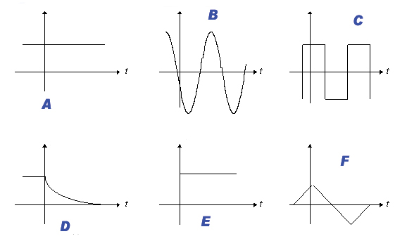

## Sinal Digital

* Muda em instantes bem definidos e só tem uma quantidade finita de valores de intensidade

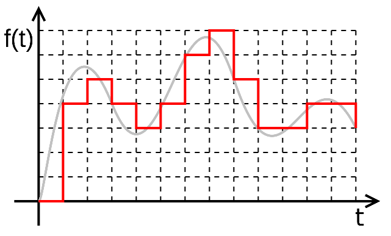

Fonte: https://www.wikipedia.org

## Sinais Digitais \(comunicação\)

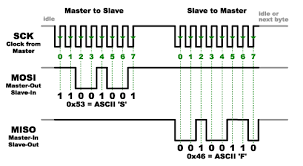

Fonte: https://learn.sparkfun.com

## Computador Digital

* Os dados recebem uma *representação digital* $\rightarrow$ *código*
* Os dados podem se mover entre os diferentes componentes do computador, através do sistema de comunicação \(barramentos\)
* Dados numéricos podem sofrer *operações*/transformações
* Dados podem ser convertidos de uma representação para uma outra

## Tamanho do computador

* Mainframes \(Computadores de Grande Porte\)
* Supercomputadores
* Minicomputadores
* Microcomputadores
* Tablets
* Celulares

## Construção

* Relé-Válvula
* Transistor
* CI - SSI, MSI, LSI
* VLSI, ULSI
* Outros: biocomputadores, computadores quânticos, computadores óticos, ...

## Circuitos Lógicos

* Componente básico em circuitos digitais: comutador
* Tecnologias para comutadores: ...
* Chave Eletrônica: 2 estados: ON/OFF
* Estado das linhas: 0/1 correspondência:
  - 0: tensão baixa (0V), corrente alta (1mA), tensão alta (5V), frequência alta, defasagem de 45&deg;, ...
  - 1: tensão alta (5V), corrente baixa (20&micro;A), tensão baixa (1V), frequência baixa, defasagem de 90&deg;, ...
* Circuitos lógicos não consideram a tecnologia dos comutadores, nem os *valores* dos sinais físicos. O importante são os valores lógicos: **0/1**, ou **F/V**.

## Componentes Lógicos \(Blocos funcionais\)

* Álgebra Booleana

* Portas lógicas - executam funções lógicas
* Os dispositivos digitais são construídos com estas portas lógicas
* Portas básicas: Inversora \(NOT\), E \(AND\) e OU \(OR\)

## Porta Inversora

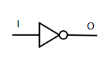

### Tabela Verdade da Porta Inversora

| I  | O  |
|----|----|
| 0  | 1  |
| 1  | 0  |

$O = I'$

## Porta E \(AND\)

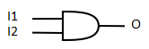

### Tabela Verdade da Porta E

| I1 | I2 |  O  |
|----|----|-----|
| 0  | 0  | 0   |
| 0  | 1  | 0   |
| 1  | 0  | 0   |
| 1  | 1  | 1   |

$O = I_1 \cdot I_2$

## Porta OU \(OR\)

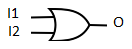

### Tabela Verdade da Porta OU

| I1 | I2 |  O  |
|----|----|-----|
| 0  | 0  | 0   |
| 0  | 1  | 1   |
| 1  | 0  | 1   |
| 1  | 1  | 1   |

$O = I_1 + I_2$

## Exemplo de uso de portas lógicas

* Deseja-se um circuito lógico que tenha saída \(O\) 1 se e apenas se \(sse, ou see\), as duas entradas \(I1 e I2\) forem iguais.

### Solução

$O = I_1' \cdot I_2' + I_1 \cdot I_2$

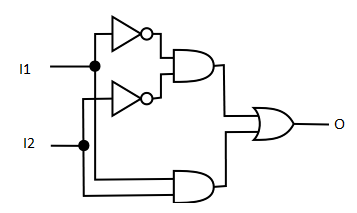

## Exercícios

1. Qual a expressão lógica para um circuito de desigualdade?
2. Forneça o diagrama de portas lógicas para o circuito de desigualdade.

## Somador \(*half adder*\)

### Tabela Verdade para Somar 2 Bits

| I1 | I2 |  S |
|----|----|----|
| 0  | 0  | 0  |
| 0  | 1  | 1  |
| 1  | 0  | 1  |
| 1  | 1  | ?  |

## Meio Somador

### Tabela Verdade para Somar 2 Bits

| I1 | I2 | S  | $C_O$ |
|----|----|----|-------|
| 0  | 0  | 0  | 0     |
| 0  | 1  | 1  | 0     |
| 1  | 0  | 1  | 0     |
| 1  | 1  | 0  | 1     |

$S = I_1' \cdot I_2 + I_1 \cdot I_2' = I_1 \oplus I_2$

$C_O = I_1 \cdot I_2$

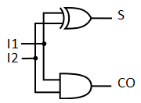

## Somador completo \(*full adder*\)

$S = C_I' \cdot I_1' \cdot I_2 + C_I' \cdot I_1 \cdot I_2' + C_I \cdot I_1' \cdot I_2' + C_I \cdot I_1 \cdot I_2 = C_I \oplus I_1 \oplus I_2$

$C_O = C_I' \cdot I_1 \cdot I_2 + C_I \cdot I_1 \cdot I_2' + C_I \cdot I_1' \cdot I_2 + C_I \cdot I_1 \cdot I_2$

### Tabela Verdade do FA

| $C_I$ | I1 | I2 | S  | $C_O$ |
|-------|----|----|----|-------|
| 0     | 0  | 0  |    |       |
| 0     | 0  | 1  |    |       |
| 0     | 1  | 0  |    |       |
| 0     | 1  | 1  |    |       |
| 1     | 0  | 0  |    |       |
| 1     | 0  | 1  |    |       |
| 1     | 1  | 0  |    |       |
| 1     | 1  | 1  |    |       |

## Tabela Verdade do FA

| $C_I$ | I1 | I2 | S  | $C_O$ |
|-------|----|----|----|-------|
| 0     | 0  | 0  | 0  |  0    |
| 0     | 0  | 1  | 1  |  0    |
| 0     | 1  | 0  | 1  |  0    |
| 0     | 1  | 1  | 0  |  1    |
| 1     | 0  | 0  | 1  |  0    |
| 1     | 0  | 1  | 0  |  1    |
| 1     | 1  | 0  | 0  |  1    |
| 1     | 1  | 1  | 1  |  1    |

## Circuito do somador completo

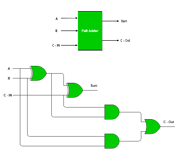

## Somador de 4 Bits

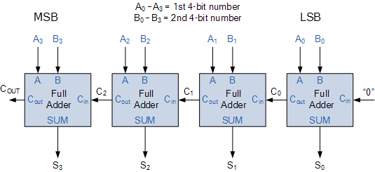

## Outras portas lógicas básicas

* NOR: $S = (I_1 + I_2)' = I_1' \cdot I_2'$
* NAND: $S = (I_1 \cdot I_2)' = I_1' + I_2'$
* XOR (OU-EXclusivo): $S = I_1' \cdot I_2 + I_1 \cdot I_2 = I_1 \oplus I_2'$
* Not-XOR: $S = I_1' \cdot I_2' + I_1 \cdot I_2 = (I_1 \oplus I_2)'$
* Portas AND, OR, NAND e NOR com mais entradas

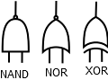
