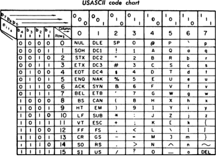
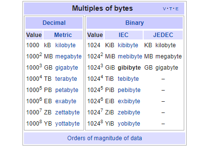

## Representação Binária

### Representação de Dados

* Diferença entre *informação* e *dados*:
  - informação tem contexto, significado
  - dados são mais abstratos: números, textos, valores
* Precisamos representar os dados em bits no computador digital.
* Num computador digital, os sinais binários correspondem a *bits* que são armazenados em elementos de memória, eles são aplicados às entradas de circuitos digitais e são as saídas desses circuitos.

##

* Um bit é um sinal, ou o estado de um elemento de memorização, que pode ter um de 2 valores binários: `0` ou `1`.

* Um *byte*, ou um octeto, é um arranjo de 8 bits.

* As memórias, em geral, são arranjadas para serem acessadas byte-a-byte. Isto é, os *endereços* de memória permitem acessar um *byte* específico de uma memória.

* Os dados \(e as instruções\) são compostos por *bytes*. Ao dizermos que um computador \(ou um processador\) trabalha com 32 ou 64 bits, isto quer dizer que o processador consegue realizar operações aritméticas com dados numéricos em 32 ou 64 bits. Ou, a *palavra* do processador é de 32 ou 64 bits. Na maioria das vezes, isto quer, também, dizer que o barramento de dados transmite palavras de 32 ou 64 bits.

## Representação de texto

* Textos são compostos por caracteres
* Os caracteres são:
  - letras maiúsculas e minúsculas de um alfabeto: a, b, c, ... e A, B, C, ...
  - sinais de pontuação: . , ! ? ; :
  - sinais gráficos: + - / \* \& \@ \$ % \( \) \[ \] \{ \} \# \' \< \> \~ \\ SP
  - dígitos: 0, 1, 2, 3, 4, 5, 6, 7, 8, 9
* Precisamos de códigos binários únicos para cada um destes caracteres:
  - ASCII - conjunto de caracteres usado na telegrafia americana, serviu de base para uma codificação de 7 bits. Além dos caracteres textuais, existem caracteres de *controle* que indicam: início de transmissão, fim de transmissão, fim de linha, sineta, DEL, ...
  - EBCEDIC - codificação usada pela IBM
  - UTF-8

## ASCII

Fonte: Wikipedia

## Representação de números inteiros em bits

* Os números poderiam ser representados diretamente como texto usando códigos como o ASCII ou o EBCEDIC. Se os números só são armazenados, esta pode ser uma boa solução. Mas, se quisermos realizar operações aritméticas com os números, este tipo de codificação não é apropriado.
* Uma representação numérica boa deve facilitar a criação de HW para implementar as operações aritméticas nos números.
* Uma representação natural que atende este requisito é a representação em base 2 dos números inteiros não negativos.

## Representação dos números em diferentes bases

### Notação de números com diferentes bases

* Base 10 \(decimal\): $1969_{10} = 1969_d = 1 \cdot 10^3 + 9 \cdot 10^2 + 6 \cdot 10^1 + 9 \cdot 10^0$
* Base 8 \(octal\): $1969_{10} = 3661_8 = 3 \cdot 8^3 + 6 \cdot 8^2 + 6 \cdot 8^1 + 1 \cdot 8^0$
* Base 2 \(binária\): $1969_{10} = 11110110001_2 = 11110110001_b = 1 \cdot 2^{10} + 1 \cdot 2^9 + 1 \cdot 2^8 + 1 \cdot 2^7 + 0 \cdot 2^6 + 1 \cdot 2^5 + 1 \cdot 2^4 + 0 \cdot 2^3 + 0 \cdot 2^2 + 0 \cdot 2^1 + 1 \cdot 2^0$
* Base 16 \(hexadecimal\): $1969_{10} = 7B1_{16} = 7B1_H = 7 \cdot 16^2 + B \cdot 16^1 + 1 \cdot 16^0$

## Tabelas de codificações importantes

| Decimal | Hexa | Octal | Binário |
|---------|------|-------|---------|
| 0       | 0    | 0     | 0       |
| 1       | 1    | 1     | 1       |
| 2       | 2    | 2     | 10      |
| 3       | 3    | 3     | 11      |
| 4       | 4    | 4     | 100     |
| 5       | 5    | 5     | 101     |
| 6       | 6    | 6     | 110     |
| 7       | 7    | 7     | 111     |
| 8       | 8    | 10    | 1000    |
| 9       | 9    | 11    | 1001    |
| 10      | A    | 12    | 1010    |
| 11      | B    | 13    | 1011    |
| 12      | C    | 14    | 1100    |
| 13      | D    | 15    | 1101    |
| 14      | E    | 16    | 1110    |
| 15      | F    | 17    | 1111    |

## Tabelas de codificações importantes(1)

| Decimal | Hexa | Octal | Binário |
|---------|------|-------|---------|
| 16=$2^4$ | 10  | 20    | 10000   |
| 32=$2^5$ | 20  | 40    | 100000  |
| 64=$2^6$ | 40  | 100   | 1000000 |
| 128=$2^7$ | 80 | 200   | 10000000 |
| 256=$2^8$ | 100 | 400  | 100000000 |
| 512=$2^9$ | 200 | 1000 | 1000000000 |
| 1K=1024=$2^{10}$ | 400 | 2000 | 10000000000 |
| 1M=$2^{20}$ | 100000 | 4000000 | 100000000000000000000 |

* Observe a aproximação: $1024 \approx 1K$

Para eliminar a dúvida de 1KB = 1000B ou 1024B, foi introduzida a noção de *Kilo binary Bytes* em 1998 pelo IEC. Agora, o correto é escrever: 1KiB, 1MiB, 1GiB, ... Mas, muitos ainda não conhecem este conceito.

## Tabelas de codificações importantes(2)
<!--
| Nome | Aproximação |
|------|-------------|
| 1K (kilo)   | $10^3 \approx 2^{10}$ |
| 1M (mega)   | $10^6 \approx 2^{20}$ |
| 1G (giga)   | $10^9 \approx 2^{30}$ |
| 1T (tera)   | $10^{12} \approx 2^{40}$ |
| 1P (peta)   | $10^{15} \approx 2^{50}$ |
| 1E (exa)   | $10^{18} \approx 2^{60}$ |
-->

## Conversão de números decimais para base 2

* Faça divisões sucessivas por 2 até o quociente ser 0
* O número em base 2 é dado pelos restos das divisões
* O bit mais significativo é o último resto, o bit menos significativo é o resto da primeira divisão

### Conversão de Binário para Decimal

* Dado um número em base 2: $b_n b_{n-1} \ldots b_1 b_0$ para convertê-lo em decimal, basta calcular: $b_n \cdot 2^n + b_{n-1} \cdot 2^{n-1} + \ldots + b_1 \cdot 2^1 + b_0 \cdot 2^0$

## Exemplo:

| Quociente | Resto |
|-----------|-------|
| 1969 | 1 |
| 984 | 0 |
| 492 | 0 |
| 246 | 0 |
| 123 | 1 |
| 61 | 1 |
| 30 | 0 |
| 15 | 1 |
| 7 | 1 |
| 3 | 1 |
| 1 | 1 |
| 0 |   |

$1969_{10} = 11110110001_2$ \(ano em que o homem pisou na lua\) 
$11110110001_2 = 2^{10} + 2^9 + 2^8 + 2^7 + 2^5 + 2^4 +1 = 1024 + 512 + 256 + 128 + 32 + 16 + 1 = 1969_{10}$

## Exercícios

1. Converta de decimal para binário:
  a. 19<!-- = 10011 -->
  b. 33<!-- = 100001 -->
  c. 42<!-- = 101010 -->
2. Converta para decimal os seguintes números:
  a. 10101010<!-- = 170 -->
  b. 110011001100<!-- = 12 . 16 .16 + 12 . 16 + 12 = 3276 -->
  c. 111000111000111<!-- = 29127 -->

## Adição de números

* 5 + 1 = 101 + 1 = 110 = $2^2 + 2^1$ = 4 + 2 = 6
* 19 + 33 = 10011 + 100001 = 110100 = $2^5+2^4+2^2$ = 32 + 16 + 4 = 52
* 31 + 2 = 11111 + 10 = 100001 = $2^5+2^0$ = 32 + 1 = 33

$\frac{\begin{array}{lrrr} &1&0&1\\+& & &1 \end{array}}{\begin{array}{lrrr}  \quad&1&1&0 \end{array}}\quad$
$\frac{\begin{array}{cccccc} &1&0&0&1&1\\1&0&0&0&0&1\end{array}}{\begin{array}{cccccc}1&1&0&1&0&0\end{array}}\quad$
$\frac{\begin{array}{cccccc} &1&1&1&1&1\\ & & & &1&0\end{array}}{\begin{array}{cccccc}1&0&0&0&0&1\end{array}}$

## Estouro \(*overflow*\)

- Os processadores tem um número fixo de bits para realizar as operações aritméticas. Por exemplo, imagine um processador de 8 bits:
  + Os números são sempre representados por 8 bits
  + Ex.: 42 $\rightarrow$ 00101010 e não simplesmente 101010

- Problema 1: o que acontece quando um número precisa de mais bits para ser representado?

- Problema 2: e se a adição de 2 números resultar num número não representável por 8 bits?

Exemplo: 100 + 200

$\frac{\begin{array}{rrrrrrrrr}\;&0&1&1&0&0&1&0&0\\&1&1&0&0&1&0&0&0\end{array}}{\begin{array}{rrrrrrrrr}1&0&0&1&0&1&1&0&0\end{array}}$ **Estouro**

## Subtração

$\frac{\begin{array}{lrrr}&1&0&1\\-&&&1\end{array}}{\begin{array}{lrrr}\;\:&1&0&0\end{array}}\quad$
$\frac{\begin{array}{lrrrrrr}&1&0&1&0&1&0\\-&&&&1&1&1\end{array}}{\begin{array}{lrrrrrr}\;\:&1&0&0&0&1&1\end{array}}\quad$
$\frac{\begin{array}{lr}&0\\-&1\end{array}}{\begin{array}{lr}\;&-1\end{array}}$

- Problema: não existe `-` num bit, como representar números negativos num computador digital?
- Solução: bit de sinal $\leftarrow$ bit mais a esquerda, *MSB*

$\frac{\begin{array}{rrrrrrrrr}\;&0&0&0&0&0&0&0&0\\-&0&0&0&0&0&0&0&1\end{array}}{\begin{array}{rrrrrrrrr}1&1&1&1&1&1&1&1&1\end{array}}$ **Estouro negativo?** \(*underflow*\)

+ Quando o bit de sinal é 0, o número é positivo, quando é 1, o número é negativo. O zero tem *sinal positivo*.

## Representação de inteiros negativos com complemento de 2

* Negue (complemento de 1) cada bit da representação positiva com o númro de bits da palavra do processador
* Adicione 1, este é o número negativo em complemento de 2 \(complemento de 1+1\)

Exemplos:

| decimal | 8 bits | 16 bits |
|---------|--------|------------------|
| -1   | 11111111  | 1111111111111111 |
| -7   | 11111001  | 1111111111111001 |
| -127 | 10000001  | 1111111110000001 |
| -130 | estouro   | 1111111101111110 |

## Por que usar representação em complemento de 2?

* Observe que se você complementar um número duas vezes, você obtém o número original (i.e., -(-x) = x)
* A operação de complementar um número é fácil de ser executada pelo HW
* Adicionar um número e o complemento de 2 de outro dá o mesmo resultado que subtrair o primeiro do segundo $\Longrightarrow$ não precisa de HW para subtração

### Exercícios

1. Calcule usando complemento de 2 com 8 bits:
  a. 15 - 7
  b. -15 + 7
  c. -128 - 1
  d. -128 - 128

## Observações importantes

* Para o complemento de 2 ter sentido sempre precisamos saber o tamanho da palavra
* A regra para saber se houve *estouro* precisa ser revista
  - Ao adicionar dois números com sinais opostos, não há *estouro*
  - Ao adicionar dois números com o mesmo sinal, há estouro se o sinal do resultado é diferente do sinal dos operandos
* O maior número positivo que podemos representar com n bits é $2^{n-1}-1$
* O menor número negativo representável com n bits é $-2^{n-1}$
* Se usamos uma palavra com n bits para representar apenas inteiros não negativos, os números representados estão no intervalo $[0, 2^n-1]$
* Ao representar números negativos com complemento de 2, os números estão no intervalo $[-2^{n-1}, 2^{n-1}-1]$
