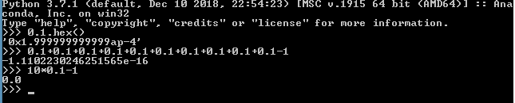
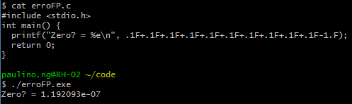

## Números reais

* Existem muitos números reais que não conseguimos representar com dígitos, por exemplo:
  - dízimas periódicas: $\frac{1}{3}=0,333...=0,\overline{333}$
  - números irracionais: $\pi=3,14159...$

* A representação com dígitos desses números é infinita. De modo análogo, a representação de muitos números reais na forma binária é infinita. Na verdade, como a base 2 é menor do que a base 10, existem mais dízimas periódicas em binário do que em decimal.

* Por exemplo, a representação de 0,1 na base 2 fica: $0,1_{10} = 0,000\overline{1100} \approx 2^{-4}+2^{-5}+2^{-8}+2^{-9}=0,099609375$

## Algoritmo para converter a parte fracionária do decimal em binário

* A conversão da parte inteira de um número com parte fracionária é como a conversão de um número inteiro: divisões sucessivas por 2
* A conversão da parte fracionária, retira a parte inteira e faz **multiplicações** sucessivas da parte fracionária, até que ela zere.

Exemplos: $0,5_{10} = 0,1_2\qquad;\qquad 0,5_{10} = 0,01_2\qquad;\qquad 0,125_{10} = 0,001_2$

$\begin{array}{r|l}Inteira&Fracionária\\0& .5\\1& .0\end{array}$
$\begin{array}{r|l}Inteira&Fracionária\\0& .25\\0&. 5\\1& .0\end{array}$
$\begin{array}{r|l}Inteira&Fracionária\\0& .125\\0& .25\\0& .5\\1& .0\end{array}$

## Conversão do 0,1

$\begin{array}{r|l}Inteira&Fracionária\\0& .1\\0& .2\\0& .4\\0& .8\\1& .6\\1& .2\\0&.4\\0& .8\\1& .6\\1& .2\end{array}$

$0,1_{10} = 0,00011\overline{0011}_2$

## Erro da aproximação

* Para checar que efetivamente 0,1 nas linguagens de programação é uma dízima podemos fazer o seguinte teste num computador:
  - Calcule: 0.1+0.1+0.1+0.1+0.1+0.1+0.1+0.1+0.1+0.1-1.0
  - Deveria dar 0 e, efetivamente, se fizer: 10 * 0.1 - 1.0 dá 0

  - Lembrete: $9_{16} = 1001_2$, o n&ordm; em binário é $1,1001\overline{1001}_2 . 2^{-4}$

## Representação em Ponto Flutuante

* Para representar números reais, em computação usamos uma representação aproximada chamada de *ponto flutuante*
* Para entender esta representação, é útil entender como funciona a *notação científica*.
* A notação científica procura separar da representação do número a **ordem de grandeza** do **valor** na grandeza.
* Os números em notação científica normalizada são sempre escritos na forma:
$d_0,d_1d_2d_3... x 10^{expo}$ onde $d_0$ está entre 1 e 9, os outros dígitos estão entre 0 e 9
* Exemplos:
  - 2020 = $2,02 . 10^3$
  - 0,0004501 = $4,501 . 10^{-4}$
  - 3,14159 = $3,14159 . 10^0$
  - $0,1_{10} = 1,0 . 10^{-1} = 0,000110011001100_2... = {(1,10011001100...)}_2 . 2^{-4}$

## Ponto Flutuante (norma IEEE 754)

* Observe que na base 2, o $d_0$ é sempre 1, por isso, na representação de ponto flutuante este 1 não é colocado, nem a vírgula. Os dígitos depois da vírgula são chamados de *mantissa*.
* Existem diferentes tamanhos de ponto flutuante (PF), as mais usadas são: 32 bits e 64 bits. Em geral, o PF de 32 bits é o *tipo de dado* **float**, o PF de 64 bits é o **double**.
* No float, o primeiro bit, o mais a esquerda, é o bit de sinal, os 23 bits seguintes correspondem aos bits após a vírgula, os últimos 8 bits representam o expoente em complemento de 2.
* No double $\rightarrow$ *procure na Internet*
* A precisão da representação é:
  - float: 6 a 8 dígitos decimais dependendo do valor do expoente
  - double: 14 a 17 dígitos. O erro de 0,1 somado 10 vezes menos 1 é $1,11 . 10^{-16}$ no Python, isto quer dizer que o número estava em dupla precisão.

## Erro do float

  - Observe que o erro em float do 0,1 é da ordem de $10^{-8}$, mas ao somar o mesmo erro 10 vezes, o erro acumulou e ficou da ordem de $10^{-7}$

## Exercícios

1. Seja função booleana: $F = (A . B)' . C'$ Mostre um circuito de portas lógicas para este circuito e a tabela verdade para esta função. Compare com $Z = (A . B . C)'$.

2. Converta para binário:
  a. $55_{10}$
  b. $CAFE_{16}$
  c. $10101010_2$

3. Calcule a representação em complemento de 2 de 8 bits para os números:
  a. 55
  b. -55
  c. 101

## Operações com Ponto Flutuante

* Adição/Subtração de números em notação científica:
  - $1,231\ .\ 10^{2} + 9,14\ .\ 10^{-2}$
  - Muda a virgula de um dos operandos para ambos terem a mesma potência:
  $12310\ .\ 10^{-2} + 9,14\ .\ 10^{-2}$
  - Soma \(ou subtrai\): $12319,14\ .\ 10^{-2}$
  - Normaliza o número: $1,231914\ .\ 10^2$
* Regras para movimentar a vírgula:
  - cada vez que a vírgula avança uma casa para a direita o expoente diminui de 1
  - cada vez que a vírgula vai para uma casa à esquerda, o expoente aumenta de 1
  - lembre-se que o número quando não está em notação científica, o expoente vale 0: $42 = 42\ .\ 10^0 = 42,\ .\ 10^0 = 4,2\ .\ 10^1 = 0,42 . 10^2 = 0,042\ .\ 10^3 = 4200,\ .\ 10^{-2} = 4200\ .\ 10^{-2}$

## Operações com Ponto Flutuante(cont.)

* Multiplicação/Divisão: $1,231\ .\ 10^{2} * 9,14\ .\ 10^{-2}$
  - Multiplica/divide os números: $1,231 * 9,14 = 11,25134$
  - soma/subtrai os expoentes: $10^2 * 10^{-2} = 10^{2-2} = 10^0$
  - normaliza o número: $11,25134\ .\ 10^0$
